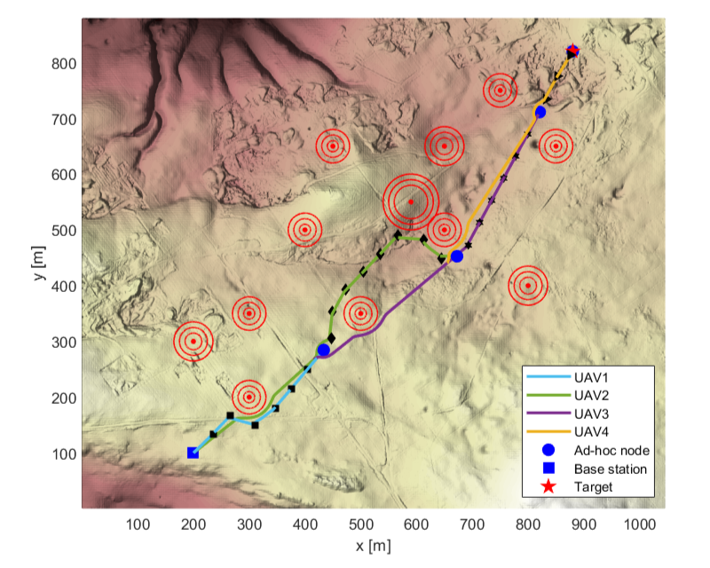
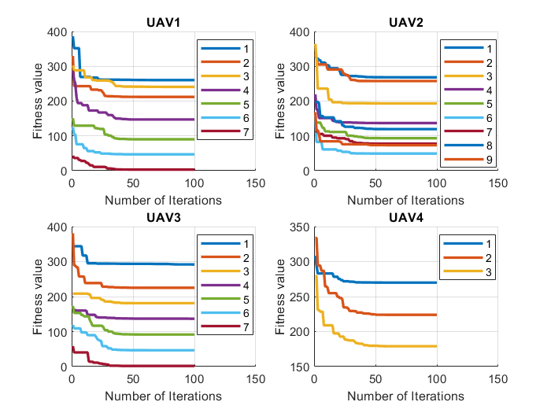

# Deploy an Optimal Multihop Ad-hoc Route in Disaster Response
N.D.T Thuy, D.N Bui, M.D Phung and H.P Duy, 'Deployment of UAVs for Optimal Multihop Ad-hoc Networks Using Particle Swarm Optimization and Behavior-based Control', *The 11th International Conference on Control, Automation and Information Sciences (ICCAIS 2022)*.
[Video demo](https://www.youtube.com/watch?v=5w8bz2UjB94)





## Cite this
The paper is available in [here](doc/2022_ICCAIS.pdf). If you use our study in an academic work, please cite:
```
@INPROCEEDINGS{Ngan2022,
  author={Ngan Duong Thi Thuy and Duy Nam Bui and Manh Duong Phung and Hung Pham Duy},
  booktitle={The 11th International Conference on Control, Automation and Information Sciences (ICCAIS 2022)}, 
  title={Deployment of UAVs for Optimal Multihop Ad-hoc Networks Using Particle Swarm Optimization and Behavior-based Control}, 
  year={2022},
  volume={},
  number={},
  pages={},
  doi={}}
```
